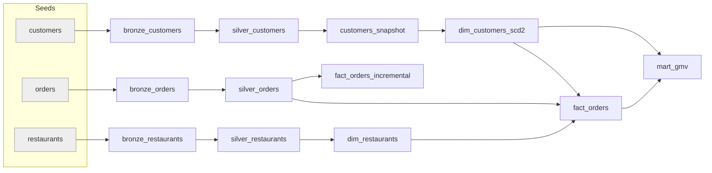
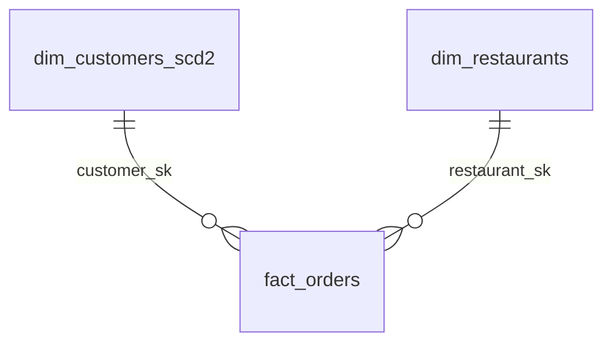

# 🍔 Food Delivery Analytics — dbt Project


An analytics-engineering project that models food-delivery data (customers, restaurants, orders) with **dbt** on **DuckDB**: layered Bronze → Silver → Gold models, an **SCD Type 2** customer dimension built from a snapshot, an **incremental** orders model, and a **GMV mart** for dashboards.

## Architecture



## Data Model (star schema)



`fact_orders` grain: one row per order. `mart_gmv` aggregates delivered orders by customer city.

## What's Implemented

| Area | Details |
|---|---|
| Seeds | customers, orders, restaurants, country_codes |
| Bronze | 3 models, raw pass-through of seeds |
| Silver | 3 models, column selection and standardised casing |
| Gold | dimensions, `fact_orders`, `fact_orders_incremental`, `mart_gmv` |
| Snapshot | `customers_snapshot` (check strategy on `city`) |
| SCD Type 2 | `dim_customers_scd2` with `customer_sk`, `dbt_valid_from/to` |
| Macro | `customer_type` (VIP / NORMAL) |
| Tests | `unique` + `not_null` on `fact_orders.order_id` |
| Environments | dev and prod DuckDB targets (see `profiles.yml.example`) |

## Quickstart

```bash
pip install -r requirements.txt
cp profiles.yml.example ~/.dbt/profiles.yml   # adjust paths if needed
dbt seed
dbt snapshot
dbt build
dbt docs generate && dbt docs serve           # lineage graph
```

## Repository Structure

```
├── models/          bronze/ silver/ gold/ (+ dbt starter examples)
├── seeds/           source CSVs
├── snapshots/       customers_snapshot.sql
├── macros/          customer_type.sql
├── tests/  analyses/
├── docs/            architecture, strategies, resume bullets, changelog
├── dbt_project.yml
├── profiles.yml.example
└── requirements.txt
```

## Documentation
Full index in [docs/README.md](docs/README.md). Highlights: [architecture](docs/architecture.md) · [data modeling](docs/data_modeling.md) · [snapshot strategy](docs/snapshot_strategy.md) · [incremental strategy](docs/incremental_strategy.md) · [testing strategy](docs/testing_strategy.md).

## Status and Roadmap
This is a learning-focused portfolio project. Known limitations are documented in [docs/implementation.md](docs/implementation.md#known-limitations), with suggested fixes in [docs/proposed_fixes](docs/proposed_fixes).

- [ ] Add `source()` definitions
- [ ] Expand tests (relationships, accepted_values)
- [ ] Stable hash-based surrogate keys
- [ ] GitHub Actions CI (`dbt build` on pull request)

## Related
Learning notes: [dbt-learning-journey](https://github.com/Kartz429/dbt-learning-journey)

## License
MIT — see [LICENSE](LICENSE).
