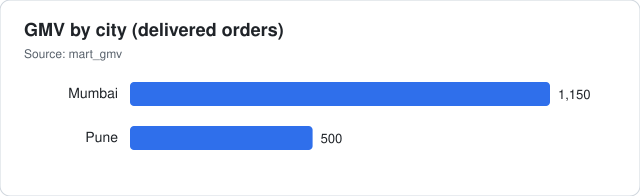
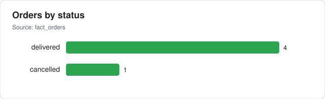
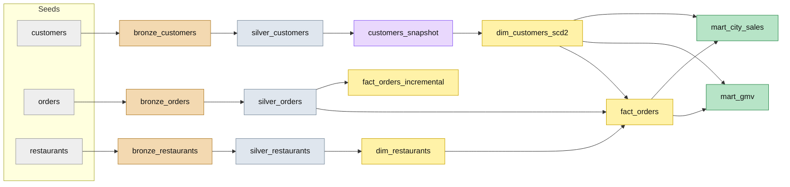
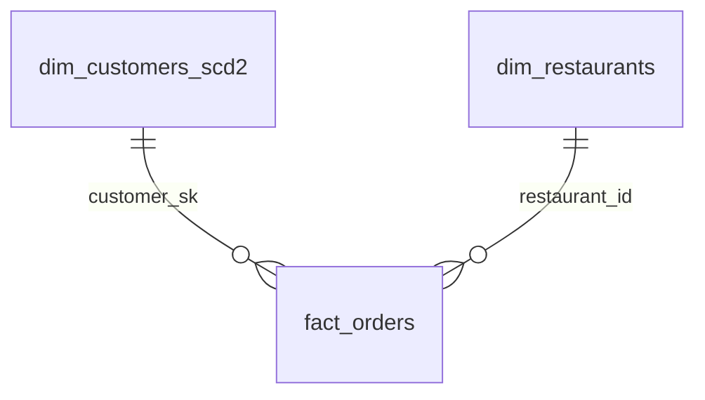

# 🍔 Food Delivery Analytics — dbt Project

[](https://github.com/Kartz429/food-delivery-dbt-project/actions/workflows/dbt_ci.yml)


An analytics-engineering project that models food-delivery data (customers, restaurants, orders) with **dbt** on **DuckDB**: layered Bronze → Silver → Gold models, an **SCD Type 2** customer dimension built from a snapshot, an **incremental** orders model, a **GMV mart** for dashboards, **26 data tests**, and **GitHub Actions CI**.

## Results (sample data)

<p>
  
  
</p>

*Charts come from the seed data via `scripts/generate_charts.py`.*

## Architecture



## Data Model (star schema)



`fact_orders` grain: one row per order. `mart_gmv` aggregates delivered orders by customer city.

## What's Implemented

| Area | Details |
|---|---|
| Seeds | customers, orders, restaurants, country_codes |
| Bronze / Silver | 3 + 3 models (raw pass-through → cleaned) |
| Gold | dimensions, `fact_orders`, `fact_orders_incremental`, marts |
| Snapshot + SCD2 | `customers_snapshot` (check on `city`) → `dim_customers_scd2` with hash `customer_sk` |
| Macro | `customer_type` (VIP / NORMAL) |
| Tests | 24 schema tests (unique, not_null, relationships, accepted_values) + 2 singular reconciliation tests |
| CI | GitHub Actions: `dbt build` + docs artifact on every push / PR |
| Environments | dev / prod / ci DuckDB targets |

## Quickstart

```bash
pip install -r requirements.txt
cp profiles.yml.example ~/.dbt/profiles.yml   # or: export DBT_PROFILES_DIR=ci
dbt build                                     # seeds + snapshot + models + tests
dbt docs generate && dbt docs serve           # lineage graph
python scripts/generate_charts.py --db dev.duckdb
```

## Repository Structure

```
├── models/          bronze/ silver/ gold/  (+ schema.yml with tests and descriptions)
├── seeds/           source CSVs
├── snapshots/       customers_snapshot.sql
├── macros/          customer_type.sql
├── tests/           singular tests
├── analyses/        gmv_by_city.sql
├── scripts/         chart generator
├── ci/              CI profile
├── .github/workflows/dbt_ci.yml
├── docs/            architecture, strategies, changelog, resume bullets
└── dbt_project.yml
```

## Documentation
Index in [docs/README.md](docs/README.md): [architecture](docs/architecture.md) · [data modeling](docs/data_modeling.md) · [snapshot strategy](docs/snapshot_strategy.md) · [incremental strategy](docs/incremental_strategy.md) · [testing strategy](docs/testing_strategy.md) · [CI/CD](docs/ci_cd_pipeline.md) · [changelog](docs/changelog.md)

## Roadmap
- [ ] `source()` definitions and freshness checks
- [ ] Order timestamps → point-in-time joins to the SCD2 dimension
- [ ] Timestamp-based incremental logic
- [ ] Publish dbt docs to GitHub Pages
- [ ] Slim CI (`state:modified+`)

## Related
Learning notes: [dbt-learning-journey](https://github.com/Kartz429/dbt-learning-journey)

## License
MIT — see [LICENSE](LICENSE).
